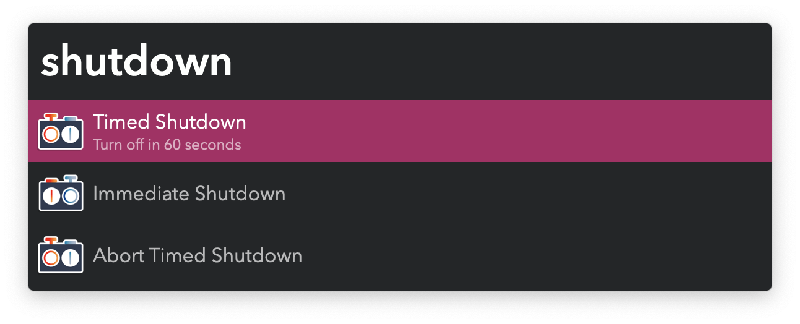

#  Shutdown Timer Alfred Workflow

Turn off macOS on a timer

[⤓ Install on the Alfred Gallery](https://alfred.app/workflows/vitor/shutdown-timer)

## Usage

Turn off your Mac on a timer via the `shutdown` keyword. [Large Type](https://www.alfredapp.com/help/features/large-type/) will show periodically with the remaining time.

Stop an ongoing timer with `shutdown abort`.

Configure the timer in the [Workflow’s Configuration](https://www.alfredapp.com/help/workflows/user-configuration/).

To trigger an immediate shutdown or restart, use the `shutdown` or `restart` keywords.
